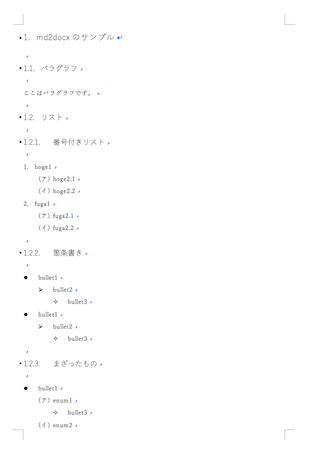

[Japanese](README_ja.md)/ English

# Sample code to convert Markdown to Docx

## Summary

Convert Markdown (*.md) to Office Open XML Document (*.docx).

## Disclaimer

USE THIS SCRIPT AT YOUR OWN RISK.

## Files

* `md2docx.rb` Convert script
* `input.md` Input makrdown file
* `template.docx` Template file

## Supporting Formats

Following items up to 3rd depth.

* header
* bullet item
* numeric item

```md:
# header1
## header2
### header3

* bullet item 1
    * bullet item 2
        * bullet item 3

1. numeric item 1
    1. numeric item 2
        1. numeric item 3
```

## Usage

```
$ ruby md2docx.rb
Using template.docx
Reading input.md
Generating output.docx
Done.
```

## Results


