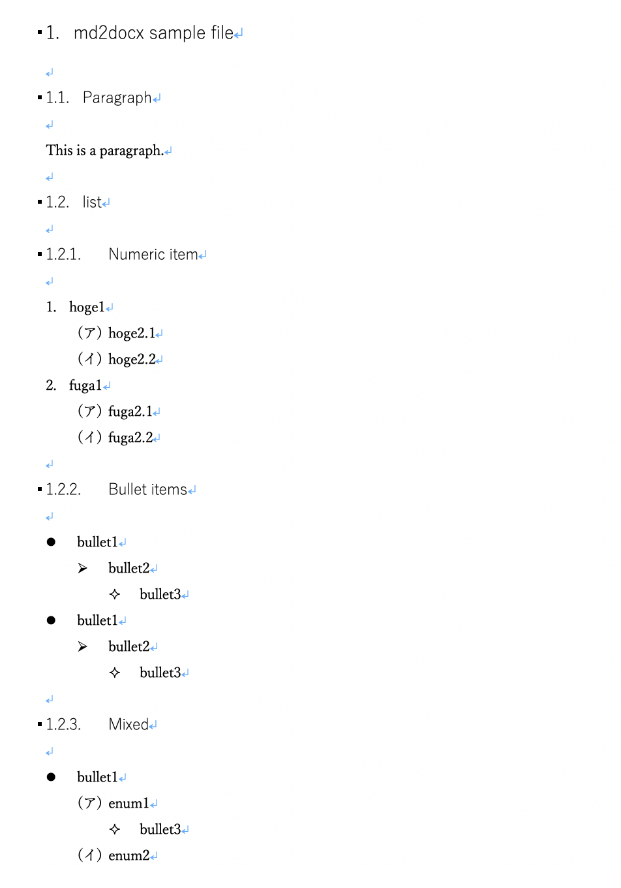

# Convert Markdown to Docx

[](LICENSE)

[Japanese](README_ja.md)/ English

## Summary

Convert Markdown (\*.md) to Office Open XML Document (\*.docx).

## Disclaimer

USE THIS SCRIPT AT YOUR OWN RISK.

## Files

* `md2docx.rb` Convert script
* `sample.md` Sample markdown file
* `template.docx` Template file

## Supporting Formats

Following items up to 3rd depth.

* header
* bullet item
* numeric item

```md:
# header1
## header2
### header3

* bullet item 1
    * bullet item 2
        * bullet item 3

1. numeric item 1
    1. numeric item 2
        1. numeric item 3
```

## Usage

```sh
$ ruby md2docx.rb
Usage: md2docx [options] file
    -t, --template [template file]
    -o, --output [output file]
```

## Results

```sh
$ ruby md2docx.rb sample.md
Using template.docx
Reading sample.md
Generating sample.docx
Done.
```

If you run the above, you will have the following `sample.docx`.

