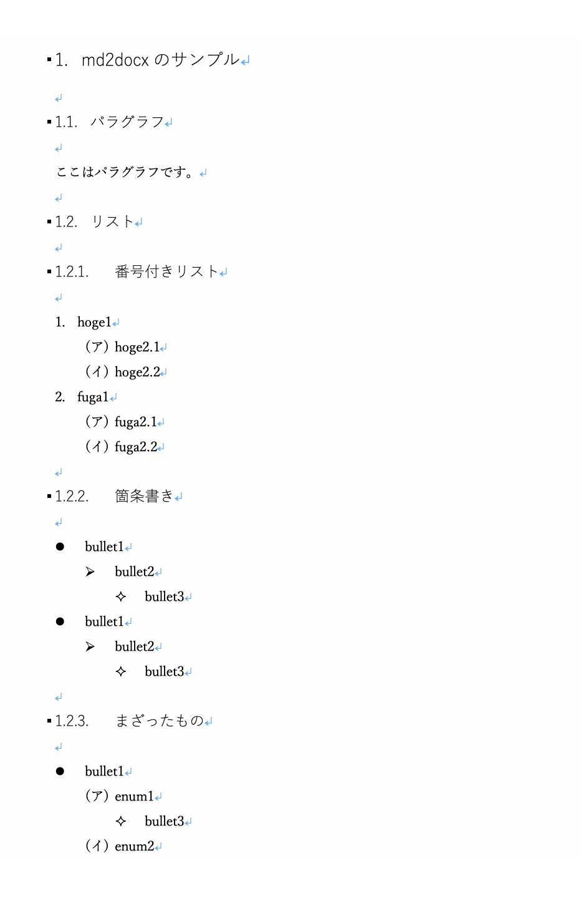

# マークダウン(\*.md)からワードファイル(\*.docx)を作るスクリプト

[](LICENSE)

Japanese/ [English](README.md)

## 概要

Markdownファイル(\*.md)から Office Open XML Document フォーマット(\*.docx)を作るサンプル。
詳細については[Qiitaに書いた解説](http://qiita.com/kaityo256/items/7794a671d2ff8d00e603)を参照のこと。
ヘッダ、箇条書き、数字付きリスト、それぞれ深さ3レベルまでしかサポートしていません。
コードのシンタックスハイライトなどもできません。

## 注意

作成されるdocxファイルが正当なものであるか保証しません。自己責任にてお使いください。

## ファイル

* `md2docx.rb` スクリプト
* `sample.md`  入力Markdownファイルのサンプル
* `template.docx` テンプレートdocxファイル

## サポートしているフォーマット

ヘッダ、箇条書き、数字付きリスト、それぞれ深さ3レベルまで。

```md:
# header1
## header2
### header3

* bullet item 1
    * bullet item 2
        * bullet item 3

1. numeric item 1
    1. numeric item 2
        1. numeric item 3
```

## 使い方

```sh
$ ruby md2docx.rb
Usage: md2docx [options] file
    -t, --template [template file]
    -o, --output [output file]
```

入力としてマークダウンファイル(`*.md`)を要求します。テンプレートを省略すると`template.docx`が仮定されます。出力を省略すると、入力ファイルの拡張子を`.docx`に変えたものになります。

## 出力結果

例えばこんなファイルを食わせます。

```md
# md2docxのサンプル

## パラグラフ

ここはパラグラフです。

## リスト

### 番号付きリスト

1. hoge1
    1. hoge2.1
    1. hoge2.2
1. fuga1
    1. fuga2.1
    1. fuga2.2

### 箇条書き

* bullet1
    * bullet2
        * bullet3
* bullet1
    * bullet2
        * bullet3

### まざったもの

* bullet1
    1. enum1
        * bullet3
    1. enum2
```

これを以下のようにしてdocxに変換できます。

```sh
Using template.docx
Reading sample_ja.md
Generating sample_ja.docx
Done.
```

以下のようなsample_ja.docxが出力されます。


