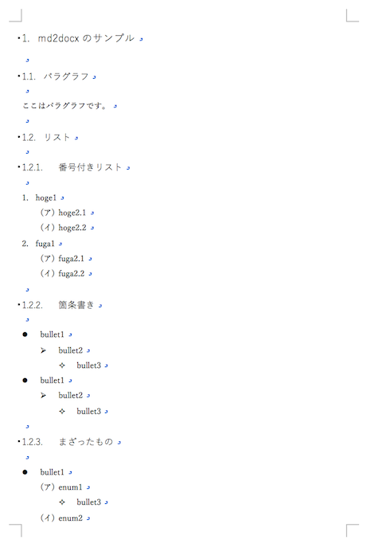

Japanese/ [English](README.md)

# マークダウン(\*.md)からワードファイル(\*.docx)を作るスクリプト

## 概要

Markdownファイル(\*.md)から Office Open XML Document フォーマット(\*.docx)を作るサンプル。

## 注意

作成されるdocxファイルが正当なものであるか保証しません。自己責任にてお使いください。

## ファイル

* `md2docx.rb` スクリプト
* `input.md`  入力Markdownファイル
* `template.docx` テンプレートdocxファイル

## サポートしているフォーマット

ヘッダ、箇条書き、数字付きリスト、それぞれ深さ3レベルまで。

```md:
# header1
## header2
### header3

* bullet item 1
    * bullet item 2
        * bullet item 3

1. numeric item 1
    1. numeric item 2
        1. numeric item 3
```

## 使い方

```
$ ruby md2docx.rb
Using template.docx
Reading input.md
Generating output.docx
Done.
```

## 出力結果

スクリプトを実行すると、以下のようなoutput.docxが出力されます。


